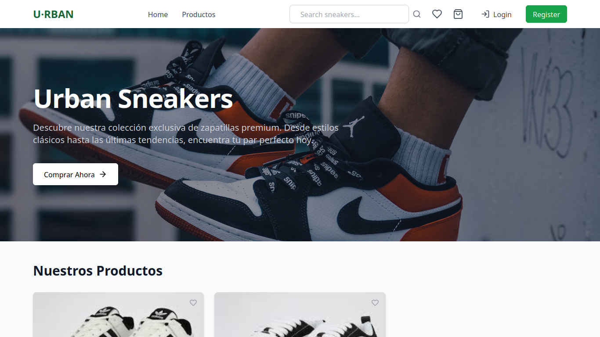

# Urban Sneakers 👟

Página web de venta de zapatillas de moda urbana. Centraliza productos de distintas marcas en un solo lugar, facilitando la experiencia de compra para los amantes del streetwear.

---

## 🛠 Stack Tecnológico


---

## 🚀 Características

- Registro e inicio de sesión de usuarios.
- Vista general de productos disponibles.
- Sistema de favoritos para guardar zapatillas preferidas.
- Carrito de compras.
- Panel de administrador para carga y gestión de productos.
- Arquitectura fullstack con backend, frontend y base de datos separados.
- Deploy y entorno de desarrollo con Docker.

---

## 📦 Instalación

### Requisitos

- Docker y Docker Compose instalados

### Pasos

```bash
git clone https://github.com/etec-integration-project/2025-backend-LucioManittaMa
cd 2025-backend-LucioManittaMa
docker compose up
```

Esto levantará la base de datos, el backend y el frontend automáticamente.

Accedé a la app desde: [http://localhost:81](http://localhost:81)

---

## 🛠 Uso Básico

Una vez levantado el entorno, el frontend estará accesible en el navegador para navegar productos, registrarse, iniciar sesión, y utilizar el panel de administrador (si tiene permisos).

### Vista previa del frontend



---

## 🤝 Contribución

Este proyecto es de acceso cerrado y no está abierto a contribuciones externas actualmente.

---

## 📜 Licencia

> ⚠️ Este proyecto no tiene una licencia definida por el momento.

---

## ✨ Créditos

Gracias a [Daniel Quinteros](https://github.com/dqmdz), profesor de Proyecto Integrador, por su guía y acompañamiento.

---
